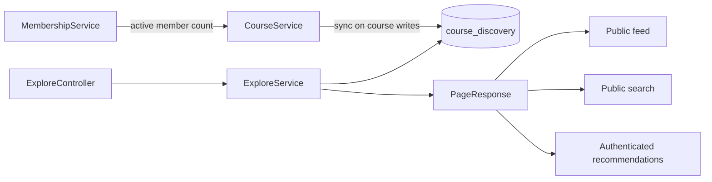

# Course Explore Design

## 1. Purpose

Course Explore is the read-only discovery surface for finding public, active
courses without exposing private course content or requiring membership. It
supports three screens:

- Public discovery feed, optionally filtered by subject.
- Public title search.
- Authenticated recommendations.

The current implementation uses a denormalized MongoDB read model so discovery
queries do not need to join the course and membership collections.

## 2. Current Architecture



### Components

| Layer               | Current component             | Responsibility                                                                      |
| ------------------- | ----------------------------- | ----------------------------------------------------------------------------------- |
| HTTP                | `ExploreApiController`        | Maps Explore routes and query parameters.                                           |
| Service             | `ExploreService`              | Validates pagination/search input, selects repository query, maps entities to DTOs. |
| Read repository     | `CourseDiscoveryRepository`   | Executes paginated MongoDB discovery queries.                                       |
| Read model          | `CourseDiscovery`             | Stores safe course summary and ranking fields in `course_discovery`.                |
| Response contract   | `CourseDiscoveryResponse`     | Prevents database entities from being returned to clients.                          |
| Pagination contract | `PageResponse<T>`             | Exposes content and stable page metadata.                                           |
| Projection writer   | `CourseService.syncDiscovery` | Copies course state and active enrollment count into the read model.                |

The source of truth remains the course and membership data. `CourseDiscovery`
is a projection and must not be used for authorization or course detail reads.

## 3. API Contract

All routes use the `/v1/explore` prefix.

### 3.1 Public feed

```http
GET /v1/explore/feed?subject={subject}&page={page}&size={size}
```

- Authentication: public.
- `subject`: optional; blank values behave like no filter.
- `page`: zero-based, default `0`, must be non-negative.
- `size`: default `20`, must be between `1` and `100`.
- Result: public and active courses, ranked by popularity descending and then
  last activity descending.

Without a subject, the repository query is:

```text
visibility = PUBLIC
status = ACTIVE
ORDER BY popularityScore DESC, lastActivityAt DESC
```

With a subject, the same filters and ordering apply, with an exact subject
match after trimming the request value.

### 3.2 Public search

```http
GET /v1/explore/courses/search?q={query}&page={page}&size={size}
```

- Authentication: public.
- `q`: required and must not be blank.
- Search matches `title` case-insensitively using MongoDB's
  `ContainingIgnoreCase` derived query.
- Results are restricted to `PUBLIC` and `ACTIVE` courses.
- Results are ranked by `popularityScore` descending.

Search is deliberately not converted to an empty feed request. A missing or
blank query is a client error (`400`).

### 3.3 Recommendations

```http
GET /v1/explore/recommendations?page={page}&size={size}
```

- Authentication: required.
- Uses the same page validation and public/active visibility rules as the feed.
- The current implementation delegates to `feed(null, page, size)`, so it is a
  popular-course list, not a user-specific recommendation model.
- The UI should label the screen `Recommended` without claiming personalized
  reasoning until a user-aware ranking strategy is implemented.

The controller currently receives an `Authentication` argument for this route,
but the service does not consume it. That is intentional for the current
fallback behavior and should be removed or used when personalization is added.

### 3.4 Response

Every route returns `PageResponse<CourseDiscoveryResponse>`:

```json
{
  "content": [
    {
      "courseId": "course-id",
      "title": "Calculus I",
      "subject": "Mathematics",
      "tags": ["calculus", "derivatives"],
      "enrollmentCount": 42,
      "popularityScore": 18.5,
      "lastActivityAt": "2026-09-09T12:00:00Z"
    }
  ],
  "page": 0,
  "size": 20,
  "totalElements": 42,
  "totalPages": 3,
  "first": true,
  "last": false
}
```

The discovery response is intentionally a summary. It does not include course
description, cover URL, owner identity, enrollment code, membership details,
or any private course content. Selecting a result should load the normal course
detail endpoint and let that endpoint enforce access.

## 4. Data Model

`CourseDiscovery` is stored in the `course_discovery` collection.

| Field                    | Purpose                                      |
| ------------------------ | -------------------------------------------- |
| `courseId`               | Unique reference to the source course.       |
| `title`                  | Searchable display title.                    |
| `subject`                | Exact subject filter and category label.     |
| `tags`                   | Future discovery labels returned to clients. |
| `visibility`             | Must mirror course visibility.               |
| `status`                 | Must mirror course status.                   |
| `enrollmentCount`        | Count of active memberships.                 |
| `popularityScore`        | Ranking score.                               |
| `lastActivityAt`         | Ranking tie-breaker and freshness signal.    |
| `createdAt`, `updatedAt` | Projection auditing.                         |

The unique index on `courseId` guarantees one projection per course.

### Indexes

- `public_course_rank`: `(visibility ASC, status ASC,
popularity_score DESC, last_activity_at DESC)` supports the unfiltered feed.
- `subject_course_rank`: `(subject ASC, visibility ASC, status ASC,
popularity_score DESC)` supports subject filtering.
- The title search currently relies on the derived query. If the collection
  grows significantly, add a MongoDB text/search index or a normalized title
  search strategy and benchmark it before changing the contract.

## 5. Projection Lifecycle

When a course is created or updated, `CourseService.syncDiscovery` creates or
updates the matching projection. It copies:

- course ID
- title
- subject
- visibility
- status
- active membership count
- current activity timestamp

This keeps private and archived courses in the projection but prevents them
from appearing in Explore through the query filters. Keeping the records makes
visibility changes reversible and avoids losing ranking history.

### Consistency requirements

Projection synchronization should be treated as eventually consistent:

1. The course write is committed as the source-of-truth operation.
2. The discovery projection is updated immediately in the current service flow.
3. A failed projection update must not make a successful course write appear
   unauthorized or expose private data.
4. A retry/rebuild job should be added for failed or stale projections.
5. A rebuild operation should derive projection rows only from active course,
   membership, and activity data, never from client-supplied discovery fields.

Membership changes should also refresh `enrollmentCount`. Course creation and
course updates currently call the synchronization path, but enrollment and
activity mutations need the same refresh policy to avoid stale ranking cards.

## 6. Ranking Design

### Current ranking

The current deterministic fallback ranking is:

```text
popularityScore DESC
lastActivityAt DESC
```

The implementation should add a stable final tie-breaker, such as `courseId
ASC`, when cursor pagination or perfectly repeatable page boundaries are
required. Offset pagination can otherwise shift when equal-score documents are
updated between requests.

### Popularity score

`popularityScore` is stored on the projection so reads remain cheap. The write
policy should be explicit before relying on it for product behavior. A first
version can combine bounded, time-windowed signals such as active enrollments,
recent activity, and detail/enrollment interactions:

```text
score = enrollmentWeight * boundedRecentEnrollments
      + activityWeight * boundedRecentActivity
      + engagementWeight * boundedRecentEngagement
```

Scores must be computed server-side, periodically or from domain events. The
client must never submit or modify a score.

### Future personalized recommendations

A personalized implementation can accept the authenticated user ID and rank
public active courses using signals such as:

- subjects of the user's active courses;
- previously viewed or joined courses;
- subject and tag affinity;
- popularity and freshness as fallback signals.

It must still apply the same public/active filter and must not reveal private
courses through recommendation metadata. The endpoint contract can remain the
same while the service changes from `feed(null, ...)` to a user-aware query or
ranking component.

## 7. Security and Privacy

Security configuration permits only `/v1/explore/feed` and
`/v1/explore/courses/search` without authentication. The recommendations route
falls through to the authenticated default rule.

Authorization is not inferred from discovery data. Explore only decides public
discoverability. Course detail, enrollment, roster, and coursework endpoints
remain responsible for membership and role checks.

The service must always force these predicates in repository queries:

```text
visibility = PUBLIC
status = ACTIVE
```

Do not implement filtering in Java after loading a page, because that would
produce incorrect pagination and could create accidental data exposure.

## 8. Frontend Behavior

The frontend should model the response as a page, not as a raw array.

Recommended screen behavior:

- Load the feed with `page=0` and `size=20`.
- Preserve `subject` and `q` while moving between pages.
- Disable next/previous controls using `first` and `last`.
- Show an empty state when `content` is empty and preserve the active filter.
- Debounce search input, but do not request search for a blank query.
- Treat a card click as navigation to the course detail flow.
- Display `enrollmentCount`, subject, tags, and recency without exposing
  internal score semantics unless product requirements call for it.
- Render `400` messages inline and treat network/`5xx` failures as a service
  unavailable state.
- Recommendations require a signed-in session; a `401` should follow the
  application's refresh-or-redirect policy.

## 9. Validation and Error Contract

Expected handled errors are JSON objects with an `error` string. Explore should
return `400` for:

- negative page;
- size below `1` or above `100`;
- blank search query.

The service already validates these conditions. The global exception handling
layer should consistently translate `IllegalArgumentException` into the
standard JSON error response rather than leaking a framework error page.

Controller-level request validation should be added for clearer OpenAPI/client
metadata, but the service validation must remain because the service is also a
unit-testable business boundary.

## 10. Test Plan

### Service tests

- Unfiltered feed requests only `PUBLIC` and `ACTIVE` rows.
- Subject feed trims input and uses the subject query.
- Search rejects null and blank queries.
- Search uses case-insensitive title matching.
- Negative page and invalid sizes are rejected.
- Mapping does not expose fields outside `CourseDiscoveryResponse`.
- Recommendations use the current feed fallback until personalization exists.

### Controller/integration tests

- Feed and search are accessible without authentication.
- Recommendations require authentication.
- Default page and size are applied.
- Invalid query parameters produce the standard `400` error body.
- Responses contain the expected `PageResponse` metadata.

### Projection tests

- Course creation/update creates or updates one projection.
- Visibility and status changes are reflected in the projection.
- Active membership changes refresh `enrollmentCount`.
- Projection failure does not bypass course authorization.
- Rebuild/retry logic is idempotent.

## 11. Implementation Gaps and Next Steps

1. Add or restore controller-level tests for the Explore routes; the repository
   currently contains service coverage but no Explore controller test file.
2. Add explicit request validation or a shared pagination validator while
   retaining service-level validation.
3. Synchronize discovery after membership and meaningful course activity changes.
4. Populate `tags` and define how they are maintained; the current course sync
   path does not copy tags.
5. Define and calculate `popularityScore`; the current projection defaults it to
   zero unless another writer updates it.
6. Add a stale-projection rebuild/retry mechanism.
7. Introduce a stable tie-breaker if page consistency becomes important.
8. Replace the recommendation fallback with a user-aware ranking strategy only
   after product signals and privacy rules are defined.
