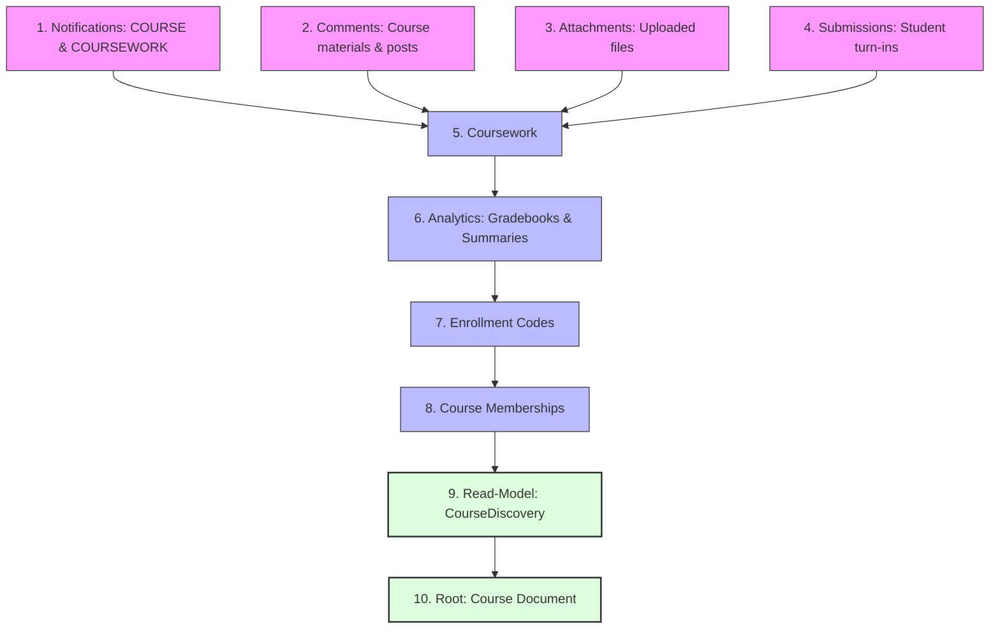

# Data Integrity & Deletion Invariants

This guide documents the data lifecycle, deletion invariants, and cleanup rules for courses and related entities in the CampusMind backend (`M198-backend`).

---

## 1. Soft-Delete (Archive) vs. Hard-Delete (Permanent Removal)

CampusMind provides two distinct deletion paths for courses:

| Characteristic | Soft-Delete (Archive) | Hard-Delete (Permanent Removal) |
| :--- | :--- | :--- |
| **API Endpoint** | `POST /v1/courses/{courseId}/archive` | `DELETE /v1/courses/{courseId}` |
| **Permission** | Course `OWNER`, `TEACHER`, or `ADMIN` | Course `OWNER` or `ADMIN` only |
| **Action** | Sets `status = CourseStatus.ARCHIVED` and records `archivedAt`. | Leaf-to-root cascading purge across all 10 MongoDB collections. |
| **Data Retention** | All coursework, submissions, grades, comments, attachments, and memberships are preserved. | Completely erased from database. Unrecoverable. |
| **Search / Explore** | `CourseDiscovery` read-model is updated with status `ARCHIVED` (excluded from public exploration). | `CourseDiscovery` projection document is deleted (`deleteByCourseId`). |
| **Use Case** | Academic terms ending, class conclusion, preserving audit trails and student grades. | Test course cleanup, GDPR / data privacy deletion requests, removing erroneous courses. |

---

## 2. Why Direct Deletion in MongoDB Breaks System Integrity

MongoDB does not provide database-level foreign key constraints or automatic cascading delete triggers. Relationships between collections are maintained as plain string IDs (e.g., `courseId`, `courseworkId`) orchestrated by application services.

Bypassing the application layer by deleting documents directly in MongoDB (via Compass, mongosh, or custom scripts) causes immediate data corruption:

1. **Stale Read-Model Projections (`course_discovery`)**:
   - The public course explorer and search index query the `course_discovery` read-model projection.
   - Deleting a course directly from the `courses` collection leaves its projection in `course_discovery` intact, causing ghost cards to show in the UI that fail when clicked.
2. **Orphaned Student Submissions & Gradebooks**:
   - Student submissions, attachments, and gradebook entries continue to reference a non-existent course, polluting global analytics and student dashboards.
3. **Ghost Memberships**:
   - Active memberships remain in `course_memberships`. When students fetch their enrolled classes, queries may return dangling memberships or throw `CourseNotFoundException`.
4. **Leaked Enrollment Codes**:
   - Active enrollment codes in `enrollment_codes` continue to resolve to non-existent courses.
5. **Dangling Notifications**:
   - Notifications pointing to `COURSE` or `COURSEWORK` ids remain unhandled in student and teacher inboxes.

---

## 3. Leaf-to-Root Cascading Deletion Order

To prevent orphaned foreign references during hard deletion, entities must be removed strictly in **leaf-to-root** order:



### Order Details:

1. **Step 1 — Notifications (`notifications`)**: Delete notifications where `resourceType = 'COURSE'` and `resourceId = courseId`, plus `resourceType = 'COURSEWORK'` for all coursework IDs belonging to the course.
2. **Step 2 — Comments (`comments`)**: Delete all comments where `courseId = courseId`.
3. **Step 3 — Attachments (`attachments`)**: Delete all attachments where `courseId = courseId`.
4. **Step 4 — Submissions (`submissions`)**: Delete all student submissions where `courseId = courseId`.
5. **Step 5 — Coursework (`coursework`)**: Delete all assignments, materials, and questions where `courseId = courseId`.
6. **Step 6 — Analytics (`student_gradebook_entries` & `course_analytics_summaries`)**: Delete all gradebook entries and summary documents where `courseId = courseId`.
7. **Step 7 — Enrollment Codes (`enrollment_codes`)**: Delete all active and expired enrollment codes where `courseId = courseId`.
8. **Step 8 — Memberships (`course_memberships`)**: Delete all teacher and student enrollments where `courseId = courseId`.
9. **Step 9 — Discovery Projection (`course_discovery`)**: Remove the denormalized explore read-model document where `courseId = courseId`.
10. **Step 10 — Course Document (`courses`)**: Permanently delete the primary course document by `_id = courseId`.

---

## 4. Manual Database Maintenance Script (mongosh)

If manual maintenance is required in MongoDB (such as in an emergency or during offline database migration), **always execute the cleanup in leaf-to-root order**.

Copy and run the following script in `mongosh`:

```javascript
/**
 * Safe Manual Course Hard-Delete Script for MongoDB (mongosh)
 * Usage: Set targetCourseId and execute in the target database.
 */
(function safeDeleteCourse(targetCourseId) {
    if (!targetCourseId || typeof targetCourseId !== "string" || targetCourseId.trim() === "") {
        throw new Error("Invalid targetCourseId provided.");
    }
    targetCourseId = targetCourseId.trim();
    print(`\n--- Initiating cascade hard-delete for course: ${targetCourseId} ---`);

    // 1. Gather all coursework IDs for the course
    const courseworkDocs = db.coursework.find({ courseId: targetCourseId }, { _id: 1 }).toArray();
    const courseworkIds = courseworkDocs.map(doc => doc._id.toString());
    print(`Found ${courseworkIds.length} coursework item(s).`);

    // 2. Notifications (Course + Coursework)
    const notifCourseRes = db.notifications.deleteMany({
        resourceType: "COURSE",
        resourceId: targetCourseId
    });
    let notifCwCount = 0;
    if (courseworkIds.length > 0) {
        const notifCwRes = db.notifications.deleteMany({
            resourceType: "COURSEWORK",
            resourceId: { $in: courseworkIds }
        });
        notifCwCount = notifCwRes.deletedCount;
    }
    print(`Deleted ${notifCourseRes.deletedCount + notifCwCount} notification(s).`);

    // 3. Comments
    const commentRes = db.comments.deleteMany({ courseId: targetCourseId });
    print(`Deleted ${commentRes.deletedCount} comment(s).`);

    // 4. Attachments
    const attachmentRes = db.attachments.deleteMany({ courseId: targetCourseId });
    print(`Deleted ${attachmentRes.deletedCount} attachment(s).`);

    // 5. Submissions
    const submissionRes = db.submissions.deleteMany({ courseId: targetCourseId });
    print(`Deleted ${submissionRes.deletedCount} submission(s).`);

    // 6. Coursework
    const courseworkRes = db.coursework.deleteMany({ courseId: targetCourseId });
    print(`Deleted ${courseworkRes.deletedCount} coursework item(s).`);

    // 7. Analytics & Gradebooks
    const gradebookRes = db.student_gradebook_entries.deleteMany({ courseId: targetCourseId });
    const analyticsRes = db.course_analytics_summaries.deleteMany({ courseId: targetCourseId });
    print(`Deleted ${gradebookRes.deletedCount} gradebook record(s) and ${analyticsRes.deletedCount} analytics summary record(s).`);

    // 8. Enrollment Codes
    const codesRes = db.enrollment_codes.deleteMany({ courseId: targetCourseId });
    print(`Deleted ${codesRes.deletedCount} enrollment code(s).`);

    // 9. Course Memberships
    const memberRes = db.course_memberships.deleteMany({ courseId: targetCourseId });
    print(`Deleted ${memberRes.deletedCount} membership(s).`);

    // 10. Course Discovery Read-Model
    const discoveryRes = db.course_discovery.deleteMany({ courseId: targetCourseId });
    print(`Deleted ${discoveryRes.deletedCount} course_discovery projection(s).`);

    // 11. Primary Course Document
    const courseRes = db.courses.deleteOne({ _id: targetCourseId });
    print(`Deleted ${courseRes.deletedCount} course root document(s).`);

    print(`\n[SUCCESS] Course ${targetCourseId} and all associated dependents successfully purged.\n`);
})("REPLACE_WITH_TARGET_COURSE_ID");
```
